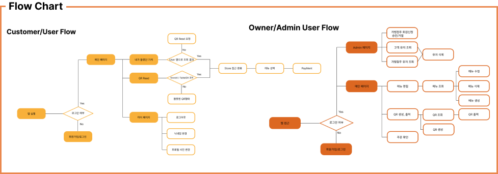
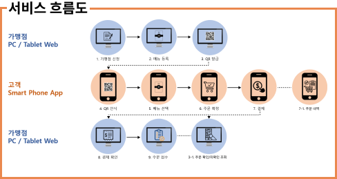
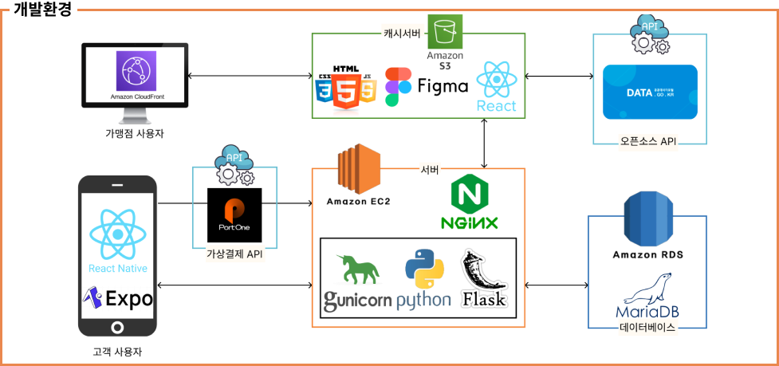

# 기존 테이블 오더 시스템을 확장하여 더욱 편리함을 제공하는 웹앱과 모바일 애플리케이션, 📲 Appnupan

## 👨‍💻 개발 동기
- 기존에 있는 테블릿이 배치된 테이블 오더 시스템은 비용이 비싸고, 유지보수가 힘들다고 생각하여 태블릿이 아닌 좀 더 저렴하고 관리가 편리한 방식으로 개발하고자 하였다.
- 손님들이 한눈에 보고 적응할 수 있는 UI를 제공하고 매장에서도 주문을 확인하고 서비스를 제공할 수 있는 시스템을 개발하고자 하였다.

## 🎉 개발 목표
- 저렴한 유지보수 비용으로 운영 및 관리 부담 해소
- 일관성 있는 고객 친화적 UI/UX 제공
- 스마트폰 환경의 QR 코드 오더 App제공
- 가게의 효율적인 운영을 지원

## 🧑‍🔬 주요 기능
- QR 스캔을 통한 메뉴 조회
- 해당 매장의 간편한 오더
- 결제 후 주문내역 확인
- 가맹점주는 실시간 주문내역 조회

## ↕️ Flow
#### 

#### 

#### 

## ⛏️ Stacks
  

      

        

  

## 🏋️‍♀️ 종사자
#### 💽 BackEnd
🦝 [탁동훈](https://github.com/edoh0617)

🐸 [유찬혁](https://github.com/ChanHyuckYou)
#### 🖥️ FrontEnd
🦁 [장현서](https://github.com/neu317)

🐸 [유찬혁](https://github.com/ChanHyuckYou)
